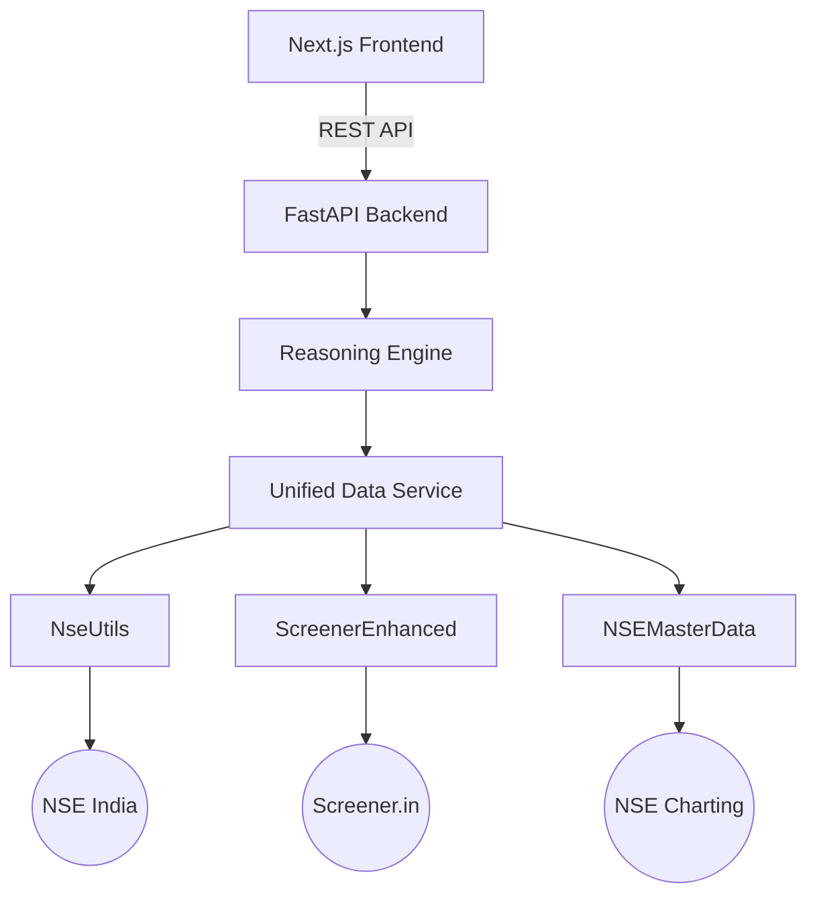

# Internal Component Architecture

This document describes the low-level Python modules and services that power the Fortune Trading Platform's backend.

---

## 1. Data Source Tier

These modules interact directly with external providers.

### 1.1 Screener Enhanced (`screener_enhanced.py`)
- **Purpose**: Scrapes fundamental data from `screener.in`.
- **Key API**: `get_complete_data(symbol)` returns P&L, Balance Sheet, Cash Flow, and Key Ratios.
- **Tech**: Uses `BeautifulSoup` and AJAX interception for peer data.

### 1.2 Nse Utils (`nse_utils.py`)
- **Purpose**: The core engine for live NSE data.
- **Capabilities**: 
  - Live Price snapshots.
  - Option Chain (CE/PE, Greeks, OI).
  - Institutional Activity (FII/DII, Bulk/Block deals).
  - Insider Trading filings.
- **Tech**: `requests.Session` with cookie management matching browser signatures.

### 1.3 NSE Master Data (`nse_master_data.py`)
- **Purpose**: Reliable historical charting data.
- **Capabilities**: Fetches 1-minute to daily historical OHLCV data from `charting.nseindia.com`.
- **Note**: Maintains ScripCode mapping for all NSE symbols.

---

## 2. Service Tier

These modules aggregate raw data into higher-level business logic.

### 2.1 Unified Data Service (`unified_data_service.py`)
Aggregates data from all sources into a single schema for the REST API.

### 2.2 Technical Analysis Service (`technical_analysis.py`)
Wraps **TA-Lib** to compute 50+ technical indicators on historical price dataframes.

### 2.3 QUAD Reasoning Engine (`reasoning_engine.py`)
The "Brain" of the project. It implements 6 analytical pillars to generate trade intents.

---

## 3. Data Flow Diagram

