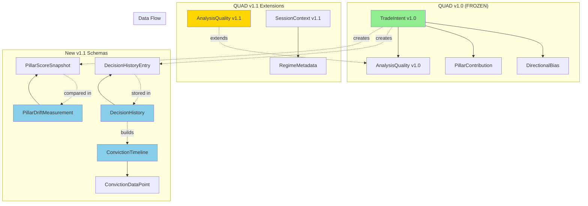

# QUAD v1.1 Schema Architecture Diagram



## Schema Hierarchy

### Core v1.0 (FROZEN - No Changes)

```
TradeIntent v1.0
├── symbol: str
├── analysis_timestamp: datetime
├── directional_bias: DirectionalBias (BULLISH/BEARISH/NEUTRAL/INVALID)
├── conviction_score: float (0-100)
├── pillar_contributions: List[PillarContribution]
│   ├── name: str
│   ├── score: float (0-100)
│   ├── bias: str
│   ├── is_placeholder: bool
│   ├── weight_applied: float
│   └── metrics: Optional[dict]
├── reasoning_narrative: str
├── quality: AnalysisQuality
│   ├── total_pillars: int
│   ├── active_pillars: int
│   ├── placeholder_pillars: int
│   ├── failed_pillars: List[str]
│   └── data_age_seconds: Optional[int]
├── is_analysis_valid: bool
├── is_execution_ready: bool
├── execution_block_reason: Optional[str]
├── degradation_warnings: List[str]
└── contract_version: str = "1.0.0"
```

### v1.1 Extensions (ADDITIVE)

```
AnalysisQuality v1.1 (extends v1.0)
├── ... (all v1.0 fields)
├── calibration_version: Optional[str]  ← NEW
└── pillar_weights_snapshot: Optional[dict]  ← NEW

SessionContext v1.1 (extends v1.0)
├── ... (all v1.0 fields)
└── regime_metadata: Optional[RegimeMetadata]  ← NEW
    ├── current_regime: MarketRegime
    ├── regime_start_time: Optional[datetime]
    ├── regime_duration_days: Optional[int]
    ├── previous_regime: Optional[MarketRegime]
    ├── last_transition_time: Optional[datetime]
    ├── transition_count_30d: int
    ├── regime_confidence: Optional[float]
    ├── vix_percentile_30d: Optional[float]
    └── regime_source: str
```

### New v1.1 Schemas

```
DecisionHistory
├── symbol: str
├── entries: List[DecisionHistoryEntry]
├── earliest_decision: Optional[datetime]
├── latest_decision: Optional[datetime]
└── total_decisions: int

DecisionHistoryEntry
├── decision_id: str (UUID)
├── symbol: str
├── analysis_timestamp: datetime
├── directional_bias: DirectionalBias
├── conviction_score: float
├── calibration_version: Optional[str]
├── pillar_count_active: int
├── pillar_count_placeholder: int
├── pillar_count_failed: int
├── engine_version: str
├── contract_version: str
├── created_at: Optional[datetime]
├── is_superseded: bool
├── pillar_scores: Optional[Dict[str, float]]
└── pillar_biases: Optional[Dict[str, str]]

ConvictionTimeline
├── symbol: str
├── data_points: List[ConvictionDataPoint]
├── start_time: Optional[datetime]
├── end_time: Optional[datetime]
└── sample_count: int

ConvictionDataPoint
├── timestamp: datetime
├── conviction_score: float
├── directional_bias: str
├── active_pillars: int
├── calibration_version: Optional[str]
└── data_age_seconds: Optional[int]

PillarDriftMeasurement
├── symbol: str
├── previous_snapshot: PillarScoreSnapshot
├── current_snapshot: PillarScoreSnapshot
├── score_deltas: Dict[str, float]
├── bias_changes: Dict[str, Tuple[str, str]]
├── max_drift_pillar: str
├── max_drift_magnitude: float
├── total_drift_score: float
├── time_delta_seconds: int
└── calibration_changed: bool

PillarScoreSnapshot
├── timestamp: datetime
├── scores: Dict[str, float]
├── biases: Dict[str, str]
├── placeholder_pillars: Set[str]
├── failed_pillars: Set[str]
└── calibration_version: Optional[str]
```

## Data Flow Diagram

```
┌─────────────────────────────────────────────────────────────┐
│                    QUAD Reasoning Engine                     │
│                                                               │
│  Input: LiveDecisionSnapshot + SessionContext v1.1          │
│  Output: TradeIntent v1.1                                    │
└─────────────────────────────────────────────────────────────┘
                            │
                            ▼
┌─────────────────────────────────────────────────────────────┐
│                    TradeIntent v1.1                          │
│  - All v1.0 fields (UNCHANGED)                              │
│  - quality.calibration_version (NEW)                        │
│  - quality.pillar_weights_snapshot (NEW)                    │
└─────────────────────────────────────────────────────────────┘
                            │
                ┌───────────┴───────────┐
                ▼                       ▼
┌───────────────────────┐   ┌───────────────────────┐
│  DecisionHistoryEntry │   │  PillarScoreSnapshot  │
│  (from_trade_intent)  │   │  (from_trade_intent)  │
└───────────────────────┘   └───────────────────────┘
                │                       │
                ▼                       ▼
┌───────────────────────┐   ┌───────────────────────┐
│   DecisionHistory     │   │ PillarDriftMeasurement│
│   (storage)           │   │ (comparison)          │
└───────────────────────┘   └───────────────────────┘
                │
                ▼
┌───────────────────────┐
│  ConvictionTimeline   │
│  (from_decision_      │
│   history)            │
└───────────────────────┘
```

## Usage Flow

### 1. Generate TradeIntent (v1.1)

```python
# Standard QUAD analysis (unchanged)
trade_intent = reasoning_engine.analyze(snapshot, context)

# v1.1: Engine now populates calibration_version
assert trade_intent.quality.calibration_version == "matrix_2024_q4"
assert trade_intent.contract_version == "1.1.0"
```

### 2. Store Decision History

```python
# Create history entry from TradeIntent
decision_id = str(uuid.uuid4())
entry = DecisionHistoryEntry.from_trade_intent(trade_intent, decision_id)

# Store in database or collection
history_service.save_entry(entry)
```

### 3. Build Conviction Timeline

```python
# Retrieve decision history for symbol
history = history_service.get_history("RELIANCE")

# Build timeline from history
timeline = ConvictionTimeline.from_decision_history(history)

# Analyze signal quality
volatility = timeline.get_conviction_volatility()
consistency = timeline.get_bias_consistency()
```

### 4. Measure Pillar Drift

```python
# Compare two consecutive analyses
previous_intent = history.entries[-2]  # Second-to-last
current_intent = history.entries[-1]   # Latest

# Calculate drift
drift = PillarDriftMeasurement.from_trade_intents(
    symbol="RELIANCE",
    previous_intent=previous_intent,
    current_intent=current_intent
)

# Get explanation
summary = drift.get_drift_summary()
# "MODERATE drift detected (33.3 total points). 
#  Sentiment increased by 15.0 points (NEUTRAL → BULLISH)."
```

## API Endpoints (Proposed)

### v1.0 Endpoints (UNCHANGED)

```
GET  /api/v1/reasoning/analyze/{symbol}
→ Returns: TradeIntent v1.1 (backward compatible)
```

### v1.1 Endpoints (NEW)

```
GET  /api/v1/decisions/history/{symbol}
→ Returns: DecisionHistory

GET  /api/v1/decisions/conviction-timeline/{symbol}
→ Returns: ConvictionTimeline

GET  /api/v1/decisions/pillar-drift/{symbol}
→ Returns: PillarDriftMeasurement (latest vs previous)

GET  /api/v1/decisions/pillar-drift/{symbol}?from={timestamp}&to={timestamp}
→ Returns: PillarDriftMeasurement (custom comparison)
```

## Database Schema (Proposed)

### decision_history table

```sql
CREATE TABLE decision_history (
    decision_id UUID PRIMARY KEY,
    symbol VARCHAR(20) NOT NULL,
    analysis_timestamp TIMESTAMP NOT NULL,
    directional_bias VARCHAR(10) NOT NULL,
    conviction_score FLOAT NOT NULL,
    calibration_version VARCHAR(50),
    pillar_count_active INT NOT NULL,
    pillar_count_placeholder INT NOT NULL,
    pillar_count_failed INT NOT NULL,
    engine_version VARCHAR(10) NOT NULL,
    contract_version VARCHAR(10) NOT NULL,
    created_at TIMESTAMP DEFAULT NOW(),
    is_superseded BOOLEAN DEFAULT FALSE,
    pillar_scores JSONB,
    pillar_biases JSONB,
    
    INDEX idx_symbol_timestamp (symbol, analysis_timestamp DESC),
    INDEX idx_created_at (created_at DESC)
);
```

### Backward Compatibility Note

- Existing `trade_intents` table can be extended with nullable columns
- No migration required for v1.0 data
- v1.1 fields populate gradually as new analyses run

---

**Document Version**: 1.0  
**Schema Version**: 1.1.0  
**Date**: 2025-12-25  
**Maintained By**: Fortune Trading Platform Architecture Team
